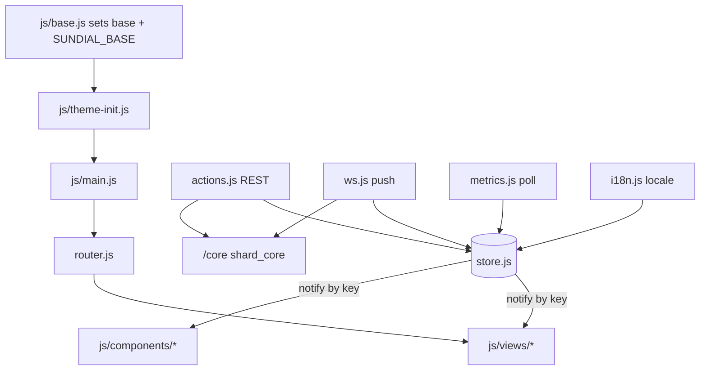

# Sundial — concepts

Sundial is the browser UI a Freeshard owner uses to run their personal server: launch and install apps, pair and manage devices, edit the public identity page, watch disk and memory, manage the subscription and VM size, trigger backups, and reveal the backup passphrase. It is a ground-up rewrite of the classic web-terminal.

Its defining constraint is that **the files in the repo are the files the browser runs**. No bundler, no transpile step, native ES modules resolved through an import map, light-DOM custom elements, vendored dependencies shipped as ESM. Most of what follows is downstream of that decision. It talks to exactly two things: the shard_core REST surface at the absolute path `/core`, and one WebSocket for live updates.

## Invariants

**Only the transport layer writes shared state.** `store.set` is called from exactly four modules — `actions.js` for REST, `ws.js` for push, `metrics.js` for polling, `i18n.js` for locale — and from none of the seventeen custom elements, which read `store.state` and re-render. A view that writes to the store violates this.

**Store patches replace whole keys, never merge fields.** `apps`, `terminals` and `disk_usage` are each written by two transports carrying identical shapes; a per-field merge would make the two writers disagree about deletions.

**The store notifies subscribers by key, and never knows who they are.** Publish–subscribe over an `EventTarget`: https://www.enterpriseintegrationpatterns.com/patterns/messaging/PublishSubscribeChannel.html — a store that called a named consumer directly would violate it. Subscription is by key or list of keys only. *(Confirmed 2026-08-22 — the wildcard `'*'` form is being removed; its only subscriber was the store's own unit test.)*

**The API root is absolute and independent of where the app is served.** traefik routes `/core` to shard_core with the prefix stripped, so a base-relative API path would 404 wherever the app is not at root. No request to `<base>/core/...` may ever be made.

**Routes are a single flat segment.** Base detection is "document path up to the last slash", so a nested route would be absorbed into the base. This is load-bearing, not stylistic.

**The two head scripts must be classic and external.** Modules are deferred, so `<base>` would be injected after stylesheet and import-map URLs resolve; inline would require `unsafe-inline`, which the CSP test forbids.

**Untrusted markdown reaches `innerHTML` through exactly one function.** `renderMarkdown` → `sanitizeHtml`, used by the welcome page, the inline editable field and the CMS banner. Every other interpolation escapes. The end-to-end test asserts DOM shape rather than script execution, because the CSP would otherwise mask a deleted sanitizer.

**WebSocket frames are shape-checked before they patch the store.** The socket is a same-origin push channel into a store with no schema, so validation is the only gate. The validator's default branch returns true so body-less types still reach the message bus.

**The CSP has one source of truth and three copies.** The `<meta>` in `index.html` is authoritative; the dev server parses it at startup, both nginx configs embed it verbatim, and a unit test asserts they match plus `frame-ancestors 'none'`. The duplication is forced: `frame-ancestors` is ignored in a meta tag, and the import map cannot be external.

**Every rendered number is honest.** The monitor distinguishes measuring, not-available and live; the sparkline breaks its path over null samples rather than interpolating; `formatBytes` and `fmtCurrencyEur` return em-dashes for null. Filler that looks plausible is a violation.

**No build step may be introduced.** The smoke suite hashes every served file against the file on disk, forbids build configs and any `dependencies` in `package.json`, and the Dockerfile has no build stage.

**The generated client is the whole API surface.** `js/api/client.js` is generated by `tools/gen_client.py` from `js/api/openapi.json`. Reaching past it is a generator gap or a stale spec dump to be closed, not an idiom to spread — so `call()` is private and has no callers outside the generated file. *(Confirmed 2026-08-22 — currently exported and used by `metrics.js` and `views/settings.js`; both gaps are open work.)*

**The router owns query state; views decide what to do with it.** The router parses and exposes query parameters and notifies on change, because a query can change while the path does not. A view consuming a one-shot entry parameter — a pairing code, a payment return flag — clears it through the router's API rather than calling the History API directly. *(Convention — https://tanstack.com/router/latest/docs/guide/search-params)*

**Alt bindings have two owners, and a tier-2 refresh may not evict tier-1 keys.** Stable component shortcuts and positional app keys are separate concepts; `keynav.js` owns the split. *(Confirmed 2026-08-22 — today they share one flat map and a positional refresh clears the range `1`–`9` and `a`–`q`, which is open work.)*

**Store-driven UI is a declarative `fs-*` element; transient overlays are imperative modules.** Modals and toasts mount into singleton slots and the modal stack auto-closes on route change, which an element mounted inside a view could not do.

## Module map

| Path | Responsibility |
| --- | --- |
| `index.html` | The single entry: CSP meta, import map, stylesheets, two classic head scripts, one module script. |
| `js/base.js` | Injects `<base>` and `SUNDIAL_BASE` before any asset URL resolves. |
| `js/theme-init.js` | Applies the persisted theme before first paint. |
| `js/main.js` | Boot: register views, hydrate the store, start router, dock, keynav, socket, service worker, metrics. |
| `js/store.js` | The only shared mutable state; publish–subscribe by key. |
| `js/actions.js` | REST hydration writers. |
| `js/ws.js` | Update socket: reconnect, payload validation, store patches, message bus. |
| `js/router.js` | Flat single-segment History-API router; base-prefixed hrefs; link interception. |
| `js/api/` | Generated client, its OpenAPI source of truth, and one hand-written client for an endpoint the server does not expose yet. |
| `js/i18n.js`, `js/i18n/` | Catalogs, `t()`, plural selection, and all locale-bound number and currency formatting. |
| `js/sanitize.js` | The single markdown-to-`innerHTML` path and the absolute-URL guard. |
| `js/keynav.js` | Geometric roving focus and the Alt-hint registry. |
| `js/metrics.js` | Poller for the stats endpoint; builds client-side history; marks unsupported on 404. |
| `js/views/` | One custom element per route. |
| `js/components/` | Base class, shared elements, and the imperative overlay modules. |
| `css/` | `tokens.css` and `fs-components.css` are copied verbatim from the Daylight Instrument design system; `app.css`, `ui.css` and `views.css` are this repo's own. |
| `tools/` | Dev server with a mock shard_core, the client generator, the i18n checker, icon generation, a CDP driver. |
| `tests/` | `node:test` units, Playwright end-to-end against the mock, and the no-build smoke suite. |
| `Dockerfile`, `data/nginx.conf` | The single-container image serving at root. This is the deployment path. |
| `deploy/` | **Dead.** The subpath install for one shard during dogfooding, superseded by the container image. Do not reconcile it with the Dockerfile. *(Confirmed 2026-08-22)* |

## Not this repo's theory

`css/tokens.css` and `css/fs-components.css` are verbatim imports from the Daylight Instrument design system; their headers and cross-references point outside this tree. `js/api/client.js` and `js/api/openapi.json` are downstream artifacts of a generator and a foreign service. Read all four as provenance, not as drift — an audit that flags them is wrong.

## Unresolved

**Whether `store.state`'s initial object declares each channel's shape or is only a placeholder its producer overwrites.** `stats` is declared as `{ history: [], latest: null }` while its only writer and only reader use `{ supported, cpu, mem, memLimit, latest }`, and Home renders before `startMetrics()` runs. Recorded unresolved on 2026-08-22 rather than inferred. An audit may raise this as a candidate; it may not assert it as a finding.
