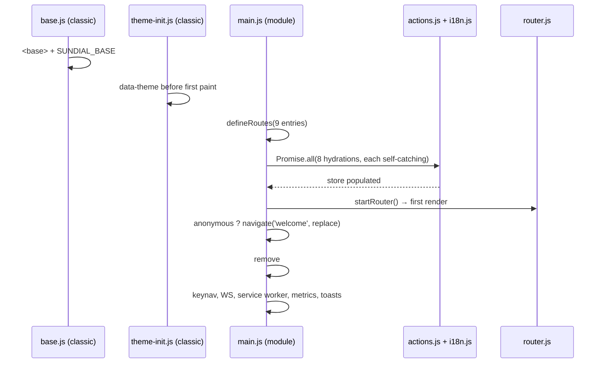

# `js/` top level — the non-visual core

The flat files in `js/` are everything the app is between the browser and the views: the boot sequence, the single store and the four writers allowed to touch it, the router, and the pure helpers (locale, sanitizing, keyboard, metrics, pricing, time) that views import but never own.

## Boot is a fixed order, and each step exists because of the step before it

Three scripts run before any module: `js/base.js` (classic), the inline import map, `js/theme-init.js` (classic), then `js/main.js` (module, deferred). `base.js` computes the app root as `location.pathname` up to the last `/` and does two different things with it — it appends a `<base>` whose `href` carries the origin, and it sets `window.SUNDIAL_BASE` to the path alone. The two forms are not redundant: every relative URL in the document (stylesheets, the import map's `./vendor/*` specifiers, `js/i18n/*.json`, `sw.js`) resolves against the absolute `<base>`, while `router.js` slices `SUNDIAL_BASE` off `location.pathname`, which is path-only. Give either consumer the other's form and it breaks.

Because the root is "path up to the last slash", a URL with a trailing slash on a route — `/sundial/apps/` — silently redefines the app root to `/sundial/apps/`, and every asset 404s. The flat-route rule in the root theory is what keeps that unreachable; nothing in `base.js` detects the case.

`theme-init.js` reads `sundial.theme` and sets `data-theme="dark"` only. Light is the absence of the attribute, so the stylesheets must default to light or an unset visitor gets an unstyled-dark flash. The key is tri-state — `dark`, `light`, absent-means-follow-`prefers-color-scheme` — but the only writer (`components/dock.js`) writes the two explicit values, so a visitor who toggles once can never return to following the system.

`main.js` has no error path. The splash is removed on the success line after `await Promise.all(...)`, so a rejection there leaves the user on the splash forever — which is why every hydration carries its own `.catch` and why `queryUiVersion` swallows internally instead. The anonymous redirect must sit between `startRouter()` and the splash removal: earlier there is no route to replace, later the user sees Home flash before Welcome.

Two `onMessage` subscriptions live in `boot()` rather than in a view — install-failure and backup-finished toasts. Both fire for work the user started on one screen and may finish on another, so a view-scoped subscription would be torn down by `disconnectedCallback` before the message arrives. `startMetrics` is gated on `meta.is_anonymous` and additionally re-checked from a `store.subscribe('meta', ...)` that is never unsubscribed; that is only safe because `startMetrics` returns early when its timer already exists. Remove that guard and pairing mid-session starts a second poller per `meta` write.

## The store replaces keys, so its writers own every derivation

`store.state` is a `structuredClone` of a module-level `initial` taken once at evaluation. There is no reset, so the store is a process-wide singleton that unit tests share; `tests/unit/store.test.js` orders its assertions around that rather than resetting.

`set` dispatches one event per key with no equality check, so writing an identical value still re-renders every subscriber. That is load-bearing in one place: while the socket is down, the reconnect loop produces an `onclose` every second and each one writes `ws` with the *same* `disconnectedSince`, so the disconnect indicator re-renders once per second for the whole outage. `subscribe` registers one handler across all requested keys and hands the callback the whole state, never the event detail — so a subscriber of `['apps', 'terminals']` is called twice by a single `set` that patches both, and a subscriber cannot tell which key woke it.

The derived getters (`shortShardId`, `shardHref`, `tourSeen`) are the sanctioned place for read-side logic; they assume `meta.identity` is always an object, which holds only because `actions.queryMetaData` merges rather than replaces `meta`. It is the one action that read-modify-writes, and it does so because `set` replaces whole keys — patching `{identity}` alone would erase `is_anonymous`.

`disk_space_warning` does not exist in shard_core: `service/disk.py` sends `total_gb`, `free_gb` and `disk_space_low` (free < 1 GB). The five-gigabyte warning tier is a Sundial invention, and because both `actions.queryDiskUsage` and `ws.js` write the whole `disk_usage` key, both must compute it. The threshold is therefore duplicated in two modules by necessity; if the two literals ever disagree, the dock warning flips depending on which transport wrote last.

`queryUiVersion` is the only action that does not go through `js/api/client.js`. `version.json` is a static file shipped beside the app, not an API resource, so it is fetched at `${BASE}version.json` — base-relative, the mirror image of the absolute `/core` rule — with a timestamp cache-buster, because the whole point is to defeat the cache that would otherwise hide a new deploy. It is also the only action invoked from a bare `setInterval` (60 s, never cleared), which is why it must resolve rather than throw: an unhandled rejection every minute is the alternative. Its result is compared against the compiled-in `VERSION` in `js/version.js` by the dock; the constant and the JSON file must be bumped together or the update badge either never appears or never goes away.

## The socket is a signal channel, not a data channel

`ws.js` is the only module that both patches the store and re-publishes on its own bus, and it needs both because `backup_update` has two consumers — a toast in `main.js` and a refresh in `views/settings.js` — while `apps_update` has none beyond the store.

Three of its shapes are checkable against the producer. shard_core's `service/websocket.py` broadcasts `backup_update` as `{"error": ...}` or `None`, `app_install_error` as `{name, error}`, and `disk_usage_update` as `DiskUsage.model_dump()`; `validateMessage` accepts exactly those. `subscription_updated` is different in kind: it arrives through `web/management/notify.py`, which broadcasts a caller-supplied type string **with no body at all**, so the handler cannot patch anything and must answer with a REST refresh (`queryProfile({refresh: true})`). That same endpoint is why the validator's default branch returns true — the type space is open-ended by server design, not by omission, and any new notify type would otherwise be dropped before reaching `onMessage`.

`terminal_add` is validated by the default branch and ignored by the store, yet it is consumed: `views/terminals.js` uses it purely as an edge to close the pairing modal. A type that patches nothing is still a contract.

`startWebSocket` installs a one-second interval and never clears it, so the first connection attempt happens up to a second *after* boot and the loop keeps ticking for the whole session, including for anonymous visitors who never connect. `connect()` assigns `socket` synchronously, which is the only thing preventing the interval from opening a second socket while the first is still `CONNECTING`. `disconnectedSince` is preserved with `?? Date.now()` across repeated closes, so the UI reports when the connection *first* dropped, not when the last retry failed.

## The router knows paths, not queries

`BASE` is captured at module evaluation from `window.SUNDIAL_BASE`, so it is fixed for the life of the page and cannot follow a base that changes after boot — `tests/unit/router.test.js` has to defeat the ESM cache with a query suffix to test a second base at all. `nameFromLocation` slices `BASE.length` off the pathname without checking the prefix; that is safe only because `BASE` is derived from that same pathname.

`render()` falls back to `''` for any unknown segment, which makes the home route mandatory: `defineRoutes` without a `''` entry throws on `def.tag` at first render. It also compares tag names before replacing, so re-navigating to the current route does not remount the element and does not run `disconnectedCallback`.

Link interception is narrow on purpose — same origin, inside `BASE`, and a *registered* route. A link to an in-base path that is not a route falls through to a full page load, which the server's SPA fallback answers with `index.html`, and the router then resolves it to home; that is the same outcome by a slower path, not a bug. It does not, however, check modifier keys, so a ctrl/cmd-click on an internal link is intercepted rather than opening a tab.

Query strings pass through the router as opaque text: `href(name, query)` concatenates them unencoded and `navigate` forwards `a.search.slice(1)`. There is no parse, no accessor, and `onRouteChange` fires with the route name only — so a query change without a path change produces no notification. Today `views/pair.js` and `views/settings.js` read `location.search` and call `history.replaceState` themselves, and the router does not learn that the URL moved.

## Language is a store key, and `t()` is synchronous

`initI18n` fetches *both* catalogs, not just the active one, because `t()` falls back to `catalogs.en` for a missing key and that fallback has to be synchronous. Its fetch path (`js/i18n/${loc}.json`) is deliberately relative so the injected `<base>` carries it under a subpath. If `initI18n` rejects — `main.js` catches and continues — `catalogs` stays empty and every `t()` call returns its own key, which is the visible failure mode to expect rather than a blank UI.

`applyLocale` writes `locale` into the store, and `FsElement.watch` silently adds `'locale'` to every subscription, so one `set` re-renders the entire UI. That is the whole mechanism of the language switcher; nothing re-fetches, which is why `setLocale` is synchronous and cannot fail.

Detection order is preferences → `localStorage` → `navigator.language` → `en`, and `js/api/preferences.js` treats a non-JSON 200 as absence because the mock dev server answers unknown `/core` GETs with `index.html`. The endpoint does not exist in shard_core yet (freeshard#168), so today `localStorage` decides. Once it ships, the server value wins over the device value on every boot — a per-device language choice becomes a per-shard one.

`t()` escapes interpolated parameters and offers `{!param}` as the opt-out, which is why `i18n.js` imports `esc` from `js/components/base.js`. That is a core module reaching into the component layer, and it is observable: `tests/unit/helpers/env.js` has to stub `globalThis.HTMLElement` before any test can import `i18n.js`, because the import pulls in a class extending it.

All locale-bound formatting lives here (`fmtNumber`, `fmtPercent`, `fmtCurrencyEur`, `intlTag`) with one deliberate exception each way: `util.formatDate` renders `YYYY-MM-DD HH:mm` with no `Intl` at all, so timestamps are unlocalized while `util.formatRelative` right beside it is fully localized through `Intl.RelativeTimeFormat`; and `metrics.formatBytes` formats memory in binary units through `fmtNumber` but lives with its only consumer.

The shard-side preference is authoritative over the device, not merely a seed for a device that has never chosen: `localStorage` is an offline cache, so once `GET /protected/preferences` ships, changing language on one device changes it on all of them. The order in `initI18n()` is therefore correct as written and must not be swapped. *(Confirmed 2026-08-22 — the endpoint does not exist yet, so no test can distinguish this from the opposite ordering.)*

## The sanitizer's allowlist decides what markdown can express

`sanitizeHtml` parses into an inert `DOMParser` document, so nothing executes during sanitizing; the output is a string the caller assigns to `innerHTML`. Unknown elements take one of two paths — the script-ish list is removed with its contents, everything else is unwrapped so its text survives. The consequence is that the allowlist is also a markdown feature list: `table`, `thead`, `tr`, `td` are absent, so a GFM table in an identity description collapses into a run of concatenated cell text rather than being rejected.

`safeUrlValue` resolves against `location.href`, so relative links inside untrusted markdown are legal and point back into the app; `isSafeHttpUrl` deliberately does not accept a base, because its callers pass API-supplied navigation targets (`approval_url`, `paypal_manage_url`) where a relative value is never correct. The two functions differing is the design, not an oversight. Every surviving `<a>` gets `target="_blank"` and `rel="noopener noreferrer"` unconditionally, in-page anchors included.

## Keyboard navigation is a global listener over a CSS-class contract

`keynav.js` never sees a component. It queries `.fs-focusable` for arrow-key targets, `[data-keyseq]` for positional hints, and `.modal-sheet` to decide scope — so an overlay traps arrow navigation because of a class name, and the containment lives here rather than in `components/modal.js`. Elements with zero-size rects are filtered out, which is what keeps hidden views out of the ring.

`moveFocus` scores candidates as `along + 2.5 * ortho` and rejects anything with `along <= 1`, so two targets sharing a centre line at the same coordinate are mutually unreachable, and a perfectly aligned neighbour always beats a nearer diagonal one.

Positional hints are recomputed on every non-repeat `Alt` keydown and their badge elements are appended into the view's own DOM, so any re-render drops them and the next Alt-hold rebuilds them. The `Alt+<key>` branch keys on `e.key`, which on macOS is the composed character (`Alt+j` → `∆`), not the letter — the whole hint layer is inert there.

## Metrics polls an endpoint that does not exist yet

`sample()` distinguishes three outcomes: 404/405 means the endpoint is absent (mark unsupported, back off ten minutes), any other failure pushes a `null` gap sample, and success appends. While unsupported, the interval keeps firing but returns immediately — history freezes at its last length rather than filling with nulls, so the sparkline after a re-probe joins two samples that are ten minutes apart on an axis labelled five seconds per step.

`/protected/stats` is genuinely absent from shard_core (freeshard#155); the endpoint exists only in `tools/dev_server.py`, which answers it with a random walk. So the unsupported branch is unreachable in every test that runs, and it keys on status alone — unlike `api/preferences.js`, which also checks the content type precisely because the mock's SPA fallback answers unknown `/core` GETs with `index.html` at status 200. Against such a server `call()` returns a `Response`, `snap.cpu_pct` is `undefined`, and the monitor reports itself supported while charting nothing but nulls.

`SAMPLE_INTERVAL_MS` and `HISTORY_LENGTH` are exported because the sparkline needs them to label its own time axis; the two numbers are a shared contract, not configuration.

The dev mock deliberately models the target service rather than the deployed one, so the `supported: false` branch is unreachable in every automated environment and is knowingly unverified. Encoding today's absence as the mock's default would bake in a transitional state. *(Confirmed 2026-08-22)*

## The three data-only helpers

`appstore.js` is the only module that talks to a third origin. Its Azure blob host is the sole reason the CSP is not `default-src 'self'`, appearing in both `img-src` and `connect-src` — and therefore in every copy of that policy the root theory enumerates. Its module-level `cache` is the only cache that exists, because the `?c=${Date.now()}` buster makes HTTP caching inert. `storeInfo` falls back to `t('apps.unknownApp')`, so it must be called during render; caching its result would freeze that string in the boot locale. The `app.store_info || app.meta?.store_info` chain exists because two shapes reach it: flat records from the store metadata blob and shard_core's `InstalledApp` with metadata nested under `meta`.

`pricing.js` holds numbers that are correct only by agreement. `VM_PRICING_EUR`, the disk rate, and both multipliers are byte-identical to `landing-page/src/components/Pricing.astro` and to `web-terminal/src/lib/pricing.js`, and nothing in this repo can detect a drift — a change on the landing page silently makes the Subscribe button lie. It is used only for the not-yet-subscribed label; an active subscription renders the controller's `price_cents` through `centsToEur`, which is what grandfathers existing subscribers. The one intentional divergence from the web-terminal original is that `formatPrice` was dropped in favour of `i18n.fmtCurrencyEur`, so the price is now locale-formatted.

`util.js` carries the assumptions the backend forces. `parseUtc` appends `Z` when a timestamp has no offset because shard_core mixes tz-aware `datetime.now(timezone.utc)` (serialized with `+00:00`) and naive `datetime.utcnow()` — reading a naive value as local time would shift every displayed timestamp by the browser's offset. `fillDiskBar` mutates `style.width` and `style.background` through the CSSOM rather than emitting a `style=` attribute, because `style-src 'self'` without `unsafe-inline` blocks the attribute while leaving CSSOM assignment untouched; it also encodes the colour policy (low → `--danger`, warning → `--accent`) that pairs with the `disk_space_warning` derivation above. `makeDeviceObject` sniffs the user agent in an order that cannot be rearranged — Edge before Chrome, Chrome before Safari, tablet before mobile — since each later pattern also matches the earlier products' strings.

## PWA registration is one line of policy

`pwa.js` resolves `sw.js` against `document.baseURI`, which caps the service-worker scope at the app root: `/` at root, `/sundial/` under the subpath. Registering an absolute `/sw.js` from a subpath install would either fail the scope check or claim the whole origin. Registration happens after the splash is gone and failure only logs, because installability is optional and `sw.js` itself is a passthrough no-op — the worker exists to satisfy the install prompt, and caching anything would break the repo's edited-files-are-served-files rule.

## Boundaries

These files own the store and its four writers, the URL-to-view mapping, the base-path convention, the locale, the sanitizer allowlist, the global key handling, and the numeric and time conventions the UI renders. They own no markup: nothing here defines a custom element, and the only DOM they touch is `#view`, `#splash` and `#dock-slot` (`router.js`, `main.js`), `document.body.dataset` and the hint badges (`keynav.js`), and one caller-supplied bar element (`util.fillDiskBar`).

They depend downward on `js/api/` for every `/core` call (with `metrics.js` reaching past the generated surface to `call()`, an open gap recorded in the root theory), on the vendored `marked` through the import map, on shard_core's WebSocket message types and disk model, on `tools/dev_server.py` for the shapes exercised in tests, and — in the one inversion — on `js/components/base.js` for `esc`.

Everything above them depends on them: every one of the nine views imports the store, and the element layer builds its hrefs through `router.href` and every string through `i18n`. The externally visible surfaces are `window.SUNDIAL_BASE` (`base.js` → `router.js`), the `sundial.theme` and `sundial.locale` storage keys, the `.fs-focusable` / `[data-keyseq]` / `.modal-sheet` / `.fs-keyhint` class contract, and `version.json` beside `js/version.js`.
