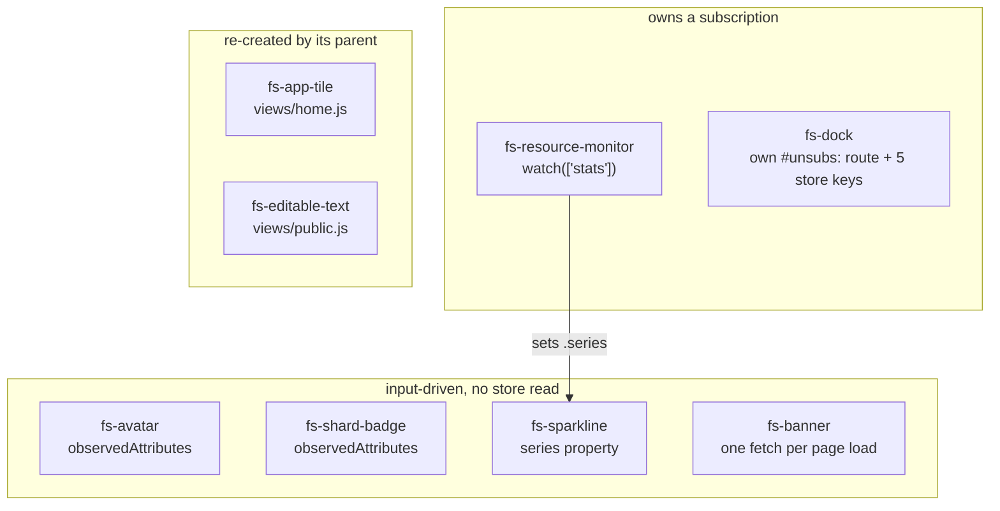

# js/components — concepts

Base class, shared elements, and the imperative overlay modules.

## The lifecycle contract

`FsElement` is not a rendering framework. It owns exactly one thing: teardown. `watch(keys, fn)` registers a store subscription and calls `fn` once immediately, `every`/`after` register timers, and `disconnectedCallback` releases all of them. An element that holds a store subscription and does not extend `FsElement` must release that subscription itself, or it keeps re-rendering a detached tree every time the store changes.

The two facilities `FsElement` withholds are as load-bearing as the one it provides. `#unsubs` and `#timers` are hard-private, so a subclass cannot register a teardown that did not come from `watch`, `every` or `after` — there is no `onDisconnect(fn)`. And `watch` speaks only the store's key vocabulary; the router's `onRouteChange` returns an unsubscribe function that has nowhere to go. `FsDock` is the one element in the module that must re-render on both a store key and a route change, and that is why it extends `HTMLElement` and hand-rolls `#unsubs` rather than inheriting. The hand-roll is a consequence of `FsElement`'s deliberate narrowness, not a deviation from it.

`watch` silently unions `'locale'` into every key list. The consequence is a rule the module keeps without stating it anywhere: an element that renders `t()` output is re-rendered on a language switch if and only if it either watches through `FsElement`, or names `'locale'` in its own subscription, or is re-created by a parent that does. `FsDock` takes the second route — `'locale'` sits in its explicit key list alongside `meta`, `ws`, `version` and `disk_usage`. `FsAppTile` and `FsEditableText` take the third: both render translated strings and neither subscribes to anything, because `views/home.js` and `views/public.js` destroy and rebuild them on every render, and both of those views watch through `FsElement`. An element here that rendered `t()` output, subscribed to nothing, and was created once by a parent that never re-renders would freeze in the boot locale.

## How data reaches an element

Three input channels exist and the choice between them is forced by the payload, not by taste. `fs-avatar` and `fs-shard-badge` declare `observedAttributes` because their inputs are short strings that a parent writes into a template literal — a string that survives `esc()` and an HTML attribute round-trip. `fs-sparkline` uses a `series` property setter that re-renders on assignment, because a series carries an array of numbers *and* a `format` callback, and a function cannot cross an attribute boundary. `fs-app-tile` uses a plain `app` property assigned before append, which is why it renders from `connectedCallback` and not from an attribute callback.

`fs-shard-badge` must not read `store.state.meta.identity.id` even though three of its four call sites pass exactly that. `views/pair.js` renders a badge for the shard named in the pairing link while the device is still anonymous and has no identity of its own; a badge that sourced its own id would render the wrong shard, or nothing, on the one screen where the id is the point.

`fs-app-tile` reads `store.state.profile` at render and at click, and subscribes to nothing. That is correct only because Home rebuilds every tile whenever it renders. The unowned edge is that Home does not watch `profile`, so a tile's blocked state is refreshed by navigation rather than by the resize that changed it.

`fs-editable-text` holds state no store key mirrors: `#state` (`off` / `on` / `syncing`), the in-progress `#editValue`, and a one-shot `#focused` latch that stops each re-render from stealing the caret back. Its `value` attribute is therefore ignored while the field is not `off`. It never calls the API. It emits `edited` with `{ value, done }` and stays disabled in `syncing` until the caller invokes `done()` — so a caller that awaits a write, catches the failure and forgets `done()` leaves the field permanently uneditable with no error shown. `views/public.js` calls `done()` on both branches.

## Markup, escaping and the CSP

Every element in this module renders by assigning a template literal to `innerHTML`, so escaping is a per-interpolation obligation. `esc()` covers `&`, `<`, `>` and `"` — sufficient because every attribute in the repo is double-quoted, and wrong the moment one is not. Translated strings escape their parameters by default; the `{!param}` form inserts raw, and the two components that use it (`fs-app-tile` for the VM-size names in the blocked-app modal, and `views/public.js` for the link in its visibility note) escape the value themselves before wrapping it in markup. Markdown is the only unescaped path, and it reaches `innerHTML` in exactly two of this module's elements — `fs-banner` for CMS content and `fs-editable-text` in its multiline read state — both through `renderMarkdown`.

The CSP forbids inline event handlers, so every fallback in this module is attached imperatively after the markup lands: `attachIconFallback` for app icons, and `fs-avatar`'s own `error` listener that removes a broken `` to expose the initials underneath. An `onerror=` attribute would leave a broken image with no fallback.

`fs-banner` is the reason the CSP is not `'self'`-only. It fetches `cnc/banners.json` from a Freeshard Azure blob, which is why that host appears in both `connect-src` (the fetch) and `img-src` (images inside the markdown). Removing the banner would remove both exceptions. It is also the only element declared in `index.html` rather than created by a view or by boot, it reads no store key, and it fetches once per page load — a window that opens mid-session is not seen until reload.

## Theme is read, never subscribed

The theme is not store state. It lives in `document.documentElement.dataset.theme` plus `localStorage`, written before first paint by `js/theme-init.js` and toggled at runtime only by `FsDock`. Nothing notifies on a change. Any element that bakes a theme-dependent value into its output at render time is therefore stale until its own next render, and two do: the dock swaps its sun/moon glyph and re-renders itself immediately, and `fs-sparkline` picks literal gradient stops and a gap-fill colour, which no one re-renders on toggle. Sparkline colours that could be expressed as CSS custom properties would not have this problem; the ones that are hard-coded do.

## The dock

The dock decides its own visibility. It blanks itself when `meta.is_anonymous` or when the route is one of `welcome`, `pair`, `restart`, which is why `js/main.js` mounts exactly one `<fs-dock>` at boot and never removes it. Its `disconnectedCallback` is consequently unreachable in the running app, and its 5-second websocket-warning grace timer is a bare `setTimeout` rather than a registered one.

It registers seven Alt shortcuts through `bindAlt`, and every one is a thunk (`() => this.querySelector(...)`) rather than an element. That is required, not stylistic: the dock replaces its entire `innerHTML` on each render, so a binding holding an element reference would point at a detached node after the first store patch or route change.

## Overlays

`openModal` is a function, not an element, because a modal must outlive the DOM that opened it and must close on navigation. The module owns a module-level `stack`, mounts each overlay into the `#overlay-slot` declared in `index.html`, and closes the whole stack from a single `onRouteChange` handler registered at import time. A modal implemented as an element inside a view would be torn down by the same route change it needs to observe.

The modal's `.modal-sheet` class name is a contract with `js/keynav.js`, which scopes arrow-key navigation to that selector when it is present. Renaming it silently releases keyboard navigation back onto the receded page. Recession itself is applied by class to `#view` and `#dock-slot`; `<fs-banner>` is deliberately outside the set of receding layers.

Toasts are a separate layer with a separate mechanism: `#toast-region` is created lazily on `document.body` with `role="status"` and `aria-live="polite"`, and sits above modals by z-index (40 against 30), not by DOM order. Toast content is set with `textContent`, never `innerHTML`, so an error string echoed from the server cannot carry markup — which matters because `errorMessage()` returns `err.detail` straight off an API error body.

`showUsagePrompt` fires the selected installs and closes without waiting for any of them to reach a terminal status. It can do that only because install progress is somebody else's job: the WebSocket patches `apps`, Home re-renders, and `fs-app-tile` renders the busy spinner from `BUSY_STATUSES`. A prompt that waited would duplicate a state the grid already shows.

## Boundaries

The module owns the element lifecycle contract, the HTML-escaping primitive, the icon set, the overlay layers (modal stack, toast region), and the app-domain vocabulary that decides what "busy", "blocked", "openable" and "displayable name" mean for an app. That vocabulary lives in `app-tile.js` alongside the element, and `views/apps.js` imports the vocabulary without the element while `views/home.js` imports the element without the vocabulary.

It depends on `store.js` (read and subscribe only — no element in this module calls `store.set`), `router.js` (`href`, `currentRoute`, `onRouteChange`, `BASE`), `i18n.js` for `t()` and locale-bound formatting, `sanitize.js` for the one markdown path, `keynav.js` for Alt bindings, `metrics.js` for `formatBytes` and the history-window constants, `api/client.js` for the two writes made from inside the module (quick feedback from the dock, app installs from the usage prompt), and `appstore.js` for store metadata. It depends on `index.html` for two element ids, `#overlay-slot` and the `#view`/`#dock-slot` recession targets.

`js/views/*` depends on it for `FsElement`, `esc`, `icon`, `openModal`, the toast functions and the shared elements — nine of the twelve `FsElement` subclasses in the repo are views, so the base class serves `js/views` more than it serves this directory. `js/main.js` depends on it for the dock, the banner and the toasts it raises from WebSocket messages. One dependency runs the other way: `js/i18n.js` imports `esc` from `components/base.js`, so a module in the transport tier depends on the component base for its escaping.
