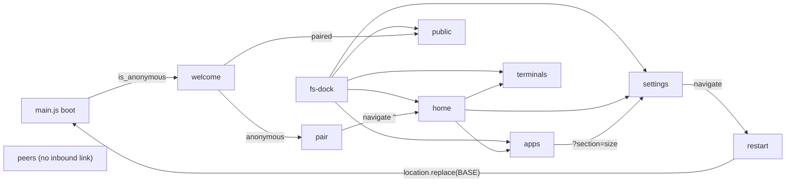

# js/views — concepts

One custom element per route: the page-level element the router mounts, which reads the store, fetches what the store does not carry, and renders the whole page as one HTML string.

## The join key

There are nine views and nine routes, one file each, and the file's basename is the join key across four separate registries: the route table in `js/main.js`, the element tag (`view-<name>`), the title catalog key (`title.<name>`), and the string namespace (`<name>.*` in `js/i18n/*.json`). Adding a view means adding an entry in all four, and nothing checks that you did. The single break in the join is on the route side: `home.js` defines `view-home` and uses `title.home`, but its route segment is the empty string, because the router treats `''` as the app root.

A view file exports nothing. Its only effect on import is `customElements.define`, and no view imports another view — every cross-view relationship is expressed as a route, never as a call. `main.js` owns both the import list and the route table; a view that registered its own route would put the two out of reach of each other.

## Render is total, wiring follows it

Every view rebuilds its entire subtree by assigning `this.innerHTML`, then queries that fresh DOM and attaches listeners. There is no diffing, no keyed reconciliation and no partial update path. The two-phase shape is not a style choice: the CSP in `index.html` grants `script-src 'self'` plus one hash and no `'unsafe-inline'`, so an `onclick=` attribute in a rendered string would not run. For the same reason no view emits a `style` attribute; the single dynamic style in the module (`terminals.js` driving the pairing-code progress bar) is written through the CSSOM, which CSP does not gate.

`render()` is called from a store notification, from a timer and from event handlers it installed itself, so it must be safe to call at any moment and must be a total function of `store.state` plus the view's private fields. The corollary is the module's sharpest hazard: a handler that calls `this.render()` has destroyed the node it is attached to, and any DOM reference captured before that call is detached afterwards. Handlers here mutate a private field, call `render()`, and touch no captured node after it.

Two places deliberately do not re-render. `terminals.js` ticks every 30 s and rewrites only the `.terminal-card__time` nodes, because a full re-render while a card is in edit mode would rebuild the name `<input>` and move the caret. `restart.js` ticks every second and rewrites only `.restart-message`, because rebuilding would restart the spinner's CSS animation. Both are narrow, both write `textContent`/a translated string into an existing node, and both exist because a periodic tick must not disturb what the user is doing.

## The title is rendered, not registered

Every view sets `document.title` as the first statement of `render()`, from `t('title.<name>', { id: shortShardId() })`. It was written the other way first — set once in `connectedCallback` — and moved into `render()` in the i18n commit (`6f37b07`), because `FsElement.watch` unions `'locale'` into every subscription: a language switch notifies the `locale` key, every mounted view re-renders, and the title re-translates with no per-view wiring and no title-change listener anywhere. The router's route record even documents a `title` slot (`name -> { tag, title }`) that no route fills, and filling it would move the title back out of reach of the locale signal. The end-to-end check with teeth is in `tests/e2e/i18n.spec.js`, which switches to German and asserts `Shard [geszt8] - Einstellungen`.

The same union is why the views that hold no store data still call `this.watch('locale', () => this.render())` — `pair`, `peers`, `public`, `restart`. That call subscribes to nothing but the language, and it is the module's idiom for "this view has no store channel".

## Where a view's data lives

No view calls `store.set`; the transport-only invariant holds across all nine. A view instead picks one of two disciplines, and which one it picks follows the store's channel list, not the view's preference.

If the datum has a store channel, the view calls the `actions.js` writer for it in `connectedCallback` and `watch`es the key, so that the same render path serves the initial fetch, the WebSocket push and the metrics poll identically — `home` and `apps` on `apps`, `terminals` on `terminals`, `welcome` on `meta`, `settings` on `profile`/`disk_usage`/`meta`. If the datum has no channel — the peer list, the default identity, the backup info, the app-store index, the pairing pre-flight — the view calls `js/api/client.js` directly and keeps the result in a private field. It has no alternative: `store.set` is reserved for the transport layer, so putting peers in the store would mean inventing a transport for them.

Private fields therefore hold exactly two things: data with no store channel, and in-flight UI state (`#busy`, `#loading`, `#editing`, `#selectedSize`, `#passphraseOpen`, `#subscribing`). `home` and `welcome` hold no fields at all — they are pure projections of the store. `settings` holds eleven, which is the honest measure of how much of the subscription flow is view state rather than shard state.

## The anonymous tier

`main.js` redirects to `welcome` whenever `meta.is_anonymous` and the current route is neither `pair` nor `welcome`. Those two views are consequently the only ones that must render against an unauthenticated session, and they are the only ones that touch `/core/public/...`. The clearest trace of the split is the avatar: `welcome.js` renders `<fs-avatar src="/core/public/meta/avatar">` while `public.js` renders the same image from `/core/protected/identities/default/avatar`. Every other view may assume a paired terminal. `public.js` additionally appends `?${performance.now()}` to that URL and re-stamps it after an upload or a clear, because an `` whose `src` is unchanged is not re-fetched.

Image URLs are also the only legitimate reason a view writes an API path by hand: `` and `<fs-avatar src>` need a URL, and the generated client returns parsed responses. `apps.js` is the only view whose images leave the origin — the app-store icons on the blob host, which is why that host appears in `img-src` and `connect-src` in the CSP. (`settings.js` also reaches the network through the generated client's private `call()`; the root theory records that as an open generator gap, not an idiom of this module.)

## Leaving a view

Views navigate through `router.href()` for links and `router.navigate()` for redirects, and never call `history.pushState` for navigation. Three sites leave the SPA outright, each because client-side state cannot survive the transition: `pair.js` does `location.replace('.')` after a URL-code pairing so the document re-boots with the new session, `restart.js` does `location.replace(BASE)` once the shard answers again, and `settings.js` assigns `location = data.approval_url` to hand off to PayPal after checking it with `isSafeHttpUrl`.

`public.js` links to the `welcome` route with `target="_blank"`, and depends on the router's click interceptor ignoring `_blank` links, so the owner previews their public page as a real document load rather than as a client-side route swap.

`peers` has no entry point at all: it is not in the dock's five destinations and no view links to it. It is reachable only by typing the URL, which is what the classic app did too.

## Escaping

Server data reaches `innerHTML` either through `esc()` at the interpolation site or as a `t()` parameter, which escapes by default. Where a view needs markup inside a translated sentence it builds the fragment itself and passes it into a slot the catalog marks `{!name}` — eight catalog keys carry such a slot, seven of them consumed by views, and at each one the escaping obligation moves from `t()` to the view: `settings.js` writes `` { when: `<b>${esc(formatRelative(...))}</b>` } ``, escaping inside the tag it built. A catalog string that changes `{!x}` to `{x}`, or a view that stops escaping inside a fragment it hands to a raw slot, breaks this quietly. The one markdown path, `welcome.js` rendering the identity description, is the sanitizer's contract and is described in the root theory.

## Overlays and out-of-band subscriptions

A view never renders a modal or a toast into its own subtree; it calls `openModal`, `toastError`/`toastSuccess` or `showUsagePrompt` and lets the overlay mount into its singleton slot, which is what lets the modal stack auto-close on route change. Inside a modal the same discipline recurses one level down: `apps.js`'s detail modal keeps a `renderFooter()` that rebuilds and re-wires the footer on every state change, and it is the module's only DOM updated without a view render.

`FsElement` unsubscribes `watch` and clears `every`/`after` timers on disconnect, so anything else a view subscribes to is its own to tear down. There are exactly two such subscriptions and they are torn down in two different places: `settings.js` holds `onMessage('backup_update')` for its whole lifetime and is therefore the only view that overrides `disconnectedCallback` (calling `super` first, then dropping the subscription and stopping its poll timers, which are raw `setInterval`/`setTimeout` rather than `every` because they must be cancellable early); `terminals.js` holds `onMessage('terminal_add')` only for the life of the pairing modal and drops it from the modal's `onClose` cleanup, together with the countdown interval.

`settings.js` also carries the module's only convergence race: PayPal returns to `?sub=return`, the `subscription_updated` WebSocket frame normally re-fetches the profile within a second, and the 3 s poll with a 60 s timeout exists only for when it does not. Polling is stopped from inside `subscriptionState()` — the render that first observes an active subscription is what tears the interstitial down, so the selector is deliberately not pure.

## Parity is the source of the asymmetries

The nine views landed in one commit (`d21383c`, "parity views") as ports of the classic Vue web-terminal, and each `connectedCallback` is the corresponding `mounted()` from `web-terminal/src/views/*.vue` minus the title line. The per-view differences are inherited rather than designed, and reading them as design is the main way to get this module wrong: `settings` does not re-fetch the profile on entry and offers a refresh button instead because `Settings.vue` did; `peers` and `public` bypass the store because `Peers.vue` and `Public.vue` bypassed Vuex; `pair` has two success paths — a full document reload after a URL code, an in-place re-hydration of five store keys after a typed code — because `Pair.vue` had exactly that split between `beforeMount` and its `pair()` method. Making any of these uniform is a change of intent, not a repair.

## Known divergence

The root theory records that the router owns query state and that a view consuming a one-shot entry parameter clears it through the router. `settings.js` diverges on both halves: it reads `new URLSearchParams(location.search)` in `connectedCallback` and in `subscriptionState()`, and clears `?sub=cancel` with `history.replaceState(null, '', location.pathname)`. `pair.js` reads `?code` the same way, though it clears it by reloading rather than through the History API. The classic app did route this through its router (`this.$route.query`, `$router.replace({query: {}})`); Sundial's router simply has no query API yet, only a `query` string argument on `href()`/`navigate()`. The consequence is visible in the `apps` → `href('settings', 'section=size')` link: the router replaces the mounted element only when the tag changes, so a query-only change while already on `settings` would never re-run the `connectedCallback` that reads `section`.

## Boundaries

The module owns page-level markup, page-level event wiring, per-view transient state, and the choice of when to leave a view. It does not own the store's shape, the route table, the API surface, overlay lifetime, keyboard navigation or styling — a view's entire contribution to keynav is the `fs-focusable` class on its primary controls and `data-keyseq` on repeated items, both declarative, with no registration call.

It depends on `js/components/base.js` for the element lifecycle, `js/store.js` for reads and derived getters, `js/actions.js` and `js/api/client.js` for writes and fetches, `js/router.js` for `href`/`navigate`/`BASE`, `js/i18n.js` for every user-visible string and every formatted number, `js/ws.js` for the two out-of-band message subscriptions, `js/sanitize.js` for markdown and URL checks, and the imperative overlay modules. `terminals.js` is the only view importing a vendored third-party module (`lean-qr`, through the import map).

Nothing imports a view. `main.js` imports the files for their side effect and names their tags in the route table; the router instantiates them by tag; `tests/e2e/*.spec.js` locate them by tag (`view-settings h1`, `view-home`) and by the CSS class names the views emit, which is the only place outside `css/views.css` where a view's internal markup is a contract.
