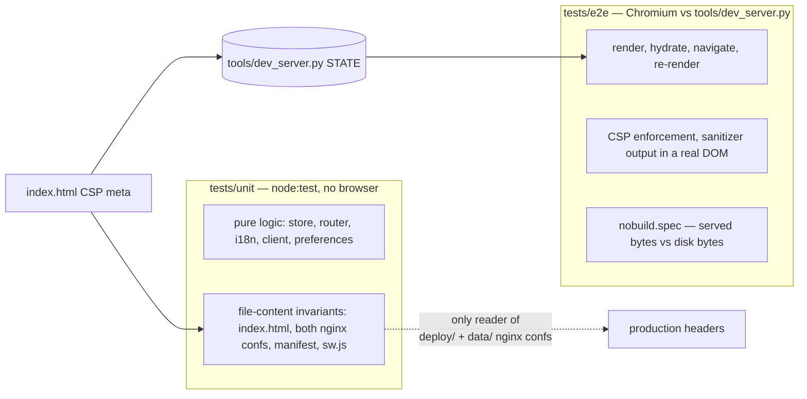

# tests — concepts

`node:test` units, Playwright end-to-end against the mock, and the no-build smoke suite.

The three layers are not three levels of thoroughness. They are three different things a check can be run against: files on disk, a module loaded outside a browser, and the app running in Chromium against a mock shard. A layer owns a class of failure because it is the only one of the three that can observe that class at all, and an assertion placed in the wrong layer either cannot fail or fails for a reason unrelated to what it names.

## Layer assignment is forced, not stylistic

The CSP invariant is split across two layers because neither layer can carry both halves. Whether `data/nginx.conf` and `deploy/nginx-sundial.conf` reproduce the policy in `index.html` is decidable only by reading three files off disk — those confs are never served and never executed by any test — so `unit/csp.test.js` is the sole guard on the production headers. Whether the policy is survivable by the app it governs is decidable only by loading the app in a browser and listening for `securitypolicyviolation`, so `e2e/security.spec.js` and `e2e/pwa.spec.js` carry that half. Moving either assertion into the other layer produces a test that passes unconditionally.

The same forcing decides which modules have unit tests. `unit/helpers/env.js` stubs exactly `window`, `location`, `history`, `document` (with `createElement`, `getElementById` and one `FakeNode` that implements `replaceChildren`/`appendChild`/`firstElementChild`), `localStorage`, `navigator` and `fetch`. That set is not a starting point to be grown; it is the definition of "unit-testable" in this repo. `store.js`, `router.js`, `i18n.js`, `api/client.js` and `api/preferences.js` touch nothing outside it, and are unit-tested. Every custom element needs real element upgrade, real layout, or a real HTML parser, and is therefore e2e-only — including `sanitize.js`, whose primitives are exercised by importing the module *inside the page* under `page.evaluate` rather than under node. A pull to unit-test a component by widening `FakeNode` toward a DOM implementation is a proposal to maintain a browser, and the stub's current size is what keeps that question closed.

`unit/router.test.js` imports `js/router.js` with a random query suffix per case because `BASE` is captured from `window.SUNDIAL_BASE` at module evaluation. Without defeating the ESM cache the file could assert about exactly one base, and the subpath deployment would have no unit coverage at all. This generalises into the unit layer's one discipline: the whole directory runs in a single node process against live module singletons with no reset hook, so each unit test either defeats the module cache or is written to be order-insensitive. `store.test.js` accumulates subscribers across cases and survives only because each case counts its own calls; `i18n.test.js` survives because every case re-runs `initI18n()` after rewriting the fetch config. A future unit test that asserts on a singleton's accumulated state will be green in isolation and red in suite order.

## The mock is a fixture, and the fixture is a second author of the assertions

E2e specs are read-only towards the mock server's `STATE`, because `fullyParallel` workers share one aiohttp process and `reuseExistingServer` keeps it alive across local runs. Every variant input therefore arrives by `page.route` interception: hostile markdown into `whoareyou` and the CMS banner, a `javascript:` `approval_url` from the subscribe endpoint, a stubbed app-store blob, frames pushed through `page.routeWebSocket`. The consequence is structural, not incidental: no state-mutating user flow is exercised end to end. Installing, uninstalling, pairing, deleting a terminal, editing the identity, starting a backup and revealing the passphrase are all reachable in the UI and all unexercised, and the mock's own `transition_app` lifecycle simulation has no caller in this directory. The suite verifies read-and-render plus interception-fed edge input; write paths are covered only where the response can be faked before it reaches the server.

Assertions are pinned to constants that live in `tools/dev_server.py`, not in this directory. `12.2 / 29.4 GiB` is arithmetic over the mock's disk fixture, `geszt8` is a prefix of the mock identity, `toHaveCount(4)` is the mock's app list length, and the update-drift test in `appstore.spec.js` works only because the mock ships filebrowser at `2.32.0` while the spec's own stub advertises `2.33.0`. Editing a number in the dev server turns specs red for a reason no assertion names. The dependency is real and one-directional; nothing declares it.

Because both sides of an e2e assertion are artifacts of this repo, agreement between them is not evidence about the real shard. `js/api/openapi.json` is the only artifact here derived from shard_core, and no test reads it — nothing compares the mock's responses to the spec, and nothing compares the app's field reads to either. Issue [#6](https://github.com/FreeshardBase/sundial/issues/6) is this gap producing a live defect rather than a hypothetical one: the app gates on `minimum_vm_size`, the shard sends `minimum_portal_size`, the mock emits `minimum_vm_size` on all four apps, and every layer agrees on a field name the real peer never produces. The claim to hold is that a mock authored alongside the app can only detect the app disagreeing with the mock's author's belief, so contract drift is the one failure class the e2e layer is structurally incapable of reporting, and closing it means testing the mock against `openapi.json`, not adding more specs.

A narrower instance of the same shape: `tools/dev_server.py` computes its CSP header by parsing `index.html` at startup. The e2e assertion that the served header equals the meta content plus `frame-ancestors 'none'` is therefore satisfied by construction, and its real content is that the dev server's mirroring is wired at all. Only the unit test constrains the two nginx copies, and nothing in the suite ever executes the nginx serving path that production uses. Locally the same derivation has a sharper edge — with `reuseExistingServer`, a dev server started before a CSP edit holds a stale snapshot and reports a mismatch that exists nowhere in the tree.

## What each guard actually forbids

The no-build smoke suite is three different guards under one filename. Byte-identity of served files against disk is near-tautological against the current dev server, which answers with a `FileResponse` of the same file; its teeth are aimed at a future transform being introduced into the serving path, and `expect(files.length).toBeGreaterThan(40)` is what stops the walk from silently enumerating nothing. The load-bearing guard is the repo-shape one: `package.json` may declare no `dependencies`, no script may match `build|bundle|compile`, `index.html` may not mention `node_modules`, and a named list of build configs and output directories may not exist. That list is a blocklist of names, so it forbids the tools it names and no others — a build step introduced under an unlisted name, or from a justfile recipe, or into the `Dockerfile`, passes. The invariant that the repo is the app is enforced against the dev-server path; the container path is checked only as text.

`unit/manifest.test.js` forbids offline caching by grepping `sw.js` for `caches`, `CacheStorage`, `indexedDB` and `importScripts`. This is a source-text check by necessity — a caching service worker's damage is a stale asset on a later run, which no single test run can observe — and it accordingly constrains spelling rather than behaviour. `e2e/pwa.spec.js` carries the behavioural half by proving a controlled page still reaches the network for `version.json`.

The security specs assert DOM shape rather than script execution deliberately. With the sanitizer deleted, the CSP would still stop `window.__xss` from firing, so `expect(window.__xss).toBeUndefined()` is decoration in every one of those tests; the assertions that can fail are `toHaveCount(0)` over `script`, `[onerror], [onclick]` and `a[href^="javascript:"]`, plus the positive ones that keep the sanitizer from being "fixed" by emptying its output. Any future XSS assertion written as an execution probe is inert for the same reason.

Falsifiability here is a property of the commits, not of the tooling. The introducing commit records breaking store notification, metrics sampling, `setLocale` and the no-build guard to watch each go red, and the security commit records the same for the welcome XSS test. There is no mutation harness and no coverage measurement, so that property is asserted once at authoring time and is not maintained by anything; a later edit that turns an assertion inert produces no signal.

Catalog completeness is not this directory's responsibility. `tools/check_i18n.py` compares `t()` call sites against both catalogs and runs as its own CI step, outside `npm test` — so `npm test` and `just test` both pass with a German key missing, and `unit/i18n.test.js` covers the resolution machinery (detection order, interpolation, escaping, `{!raw}`, plural selection, missing-key passthrough, Intl formatting, `setLocale` persistence and PUT) against a handful of keys it names explicitly.

## What the suite cannot see

Layout is verified by geometric predicates — computed `gridTemplateColumns` length, bounding-box comparisons, `scrollWidth` against `innerWidth` — and never by pixels. There are no screenshot baselines, so every colour, token, spacing and typography regression is invisible, including drift in the two CSS files vendored from the design system.

The fixture has one mode. Playwright's `webServer` starts `tools/dev_server.py` with no flags, so the shard is always paired with one identity and four apps; `--anonymous` has no automated run, and `/welcome` and `/pair` are visited in `security.spec.js` in the paired state. Anything branching on `meta.is_anonymous` being true renders in no test.

`keynav.js` has no unit test and no spec presses Alt; the theme applied by `theme-init.js` is never switched; `metrics.js` is exercised only through its happy path, so the `supported: false` branch that the honest-numbers rule depends on is never rendered. Issue [#7](https://github.com/FreeshardBase/sundial/issues/7) — Alt shortcuts dying after the first hold — survived the whole suite for exactly the first of those reasons, which is the general shape: an untested module is not a module with weaker guarantees here, it is a module the suite makes no claim about.

`unit/store.test.js:27` is the only subscriber to `store.subscribe('*')` anywhere in the tree. A test may not be the sole reason a production export exists; where that happens the test has stopped checking the code and started justifying it.

Hermeticity is a rule over the whole suite, not a per-spec courtesy: no spec may reach the network. It is currently violated, because `fs-banner` sits in the page shell and every `page.goto` fetches live from the Azure store blob, which makes geometry assertions depend on whatever banner content is published that day. Tracked as issue #10; the rule stands as written and the implementation is what must catch up. *(Confirmed 2026-08-22)*

## Boundaries

This directory owns the executable claims about Sundial's behaviour and about the repo's shape, and the decision of which layer a claim belongs in. It owns no fixtures of its own beyond per-spec route stubs.

It depends on `tools/dev_server.py` for the mock contract, the fixture constants, the static serving path and the CSP header mirroring; on the repo-root files it reads directly (`index.html`, `manifest.webmanifest`, `sw.js`, `package.json`, `data/nginx.conf`, `deploy/nginx-sundial.conf`); and on the `js/` modules whose exports it imports. `playwright.config.js` and `package.json` at the root are its runner configuration, not part of it.

`.github/workflows/ci.yml` depends on it, running `npm run test:unit` and `npm run test:e2e` as separate steps after `tools/check_i18n.py`; the `test`, `test-unit` and `test-e2e` justfile recipes are thin aliases over the same scripts. Because the no-build guard lives under `tests/e2e/`, `npm run test:unit` alone does not enforce it.
