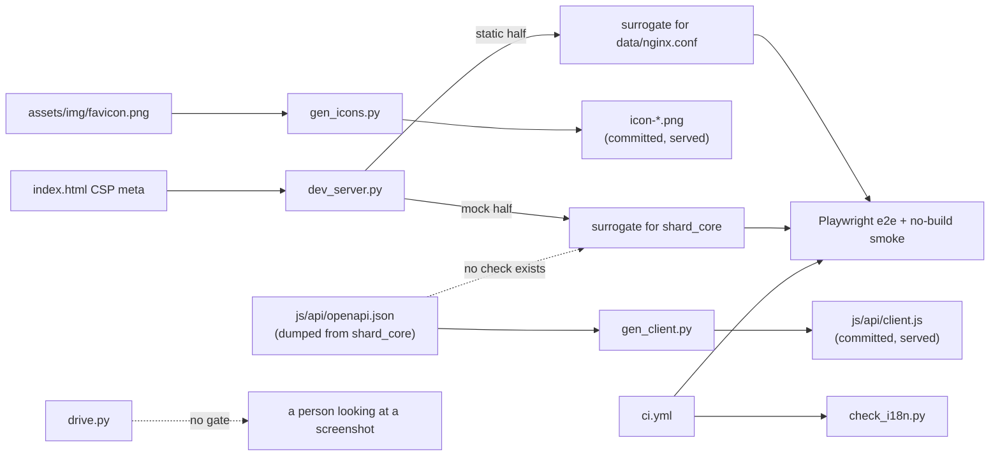

# tools — concepts

`tools/` holds the offline instruments: a dev server that stands in for both nginx and shard_core, three generators/checkers whose outputs are committed and served as-is, and one manual browser driver.

Nothing here is served to a browser and nothing here is imported by the app, so the no-build rule does not bind these files — they are Python, they may take dependencies, and `dev_server.py`, `gen_icons.py` and `drive.py` carry PEP 723 inline dependency headers so `uv run` is the whole setup. What binds them instead is that three of them produce artifacts the app *does* serve, and one of them produces the world the test suite believes in.

## The mock may omit what shard_core sends; it may never rename it

This is the module's load-bearing obligation, and it is asymmetric on purpose. Omission is free: the mock's app `meta` objects carry four fields where `AppMeta` declares twelve, five of them required (`v`, `name`, `icon`, `entrypoints`, `paths`), and its `profile` drops `billing_enabled` and both `paypal_*` fields. None of that costs anything, because a field no view reads is a field the mock need not carry — the mock's job is to be *a* valid response, not a complete one. Renaming is not free, because the reading code's spelling is copied from whatever the mock spells, and e2e is the only place that reading code ever meets a shard_core-shaped body. A name the mock invents is a contract CI certifies and production refuses.

The authority to check against is not the remote service; it is `js/api/openapi.json`, sitting in this repo, dumped from the same FastAPI app. It has been there since commit `a981d90`, the same commit that introduced the mock — so `minimum_vm_size` (issue #6; the spec and the service both say `minimum_portal_size`) was never a drift that time opened up, it was wrong on the day it was written, against a file one directory away. The blast radius is legible in the app: `js/views/apps.js` reads all three candidate spellings in an `||` chain, while `js/components/app-tile.js` reads only the mock's, so the block-by-size affordance is the one that fails on a real shard.

Stated as the check that does not exist: every key name appearing in a mock response body must appear in the schema `openapi.json` associates with that path. No test reads both files — `tests/unit/csp.test.js` is the only test that mentions either script, and only in a comment. This is the single most valuable assertion the module could grow, and it is cheap, because both inputs are committed JSON and Python.

## The mock is one fixture, not a fixture matrix

Every UI branch keyed on a field the mock hardcodes is unreachable through the mock. The design's answer to that is a CLI flag per discriminating field, and it has exactly one instance: `paired` got `--anonymous`, which is why the welcome and pairing flows are reachable at all. `subscription` did not, so `STATE["profile"]["subscription"]` is permanently `None` and every subscription-active branch in `js/views/settings.js` — price display, pending resize, reactivate — renders in no test. The flag approach does not scale past a handful of fields, and the repo already contains the alternative it has not applied to `/core`: `tests/e2e/appstore.spec.js` and `security.spec.js` build their fixtures with Playwright route interception instead. Interception is used only against the Azure store blob today; nothing intercepts a `/core` route.

The sharpest case is `/core/protected/stats`. shard_core has no such route — `shard_core/web/protected/stats.py` exposes `/disk` and `/tasks` only — and `js/metrics.js` says so in its header. The mock serves it anyway, as a random walk, so `tests/e2e/monitor.spec.js` asserts live sparklines while every shard in the field returns 404. The consequence is not that the mock is ahead of the server, which is deliberate and fine; it is that `supported: false` in `metrics.js` and the unsupported render in `js/components/resource-monitor.js` are the *production-true* state today and are executed by nothing. A mock that is ahead of the service owes the behind-state a second fixture.

The mock's contract is with the shard_core being built, not the one deployed today. It serves `/protected/stats` as a 200 even though no shipped shard does, because the UI is built ahead of the server on purpose. The cost is that CI cannot exercise the unsupported path; that is a gap in `tests/`, not in this module. *(Confirmed 2026-08-22)*

## The mock's mutable state is a dev affordance, not a test fixture

`transition_app` walks an app through `installation_queued → installing → running` on one- and three-second sleeps and broadcasts each step. Nobody writes a test around four seconds of sleeps, and the history agrees: the staged transitions arrived in the scaffold commit `a981d90`, the test suite in `16f00c8`. The mutating routes — install, uninstall, reinstall, terminal edit and delete, tour writes, the passphrase read that stamps `last_passphrase_access_info` — exist so a person can watch the UI move.

The test suite then had to work around them, because `STATE` is a process global and Playwright runs workers in parallel against one server. The read-only rule in `playwright.config.js` and `agents.md` is that accommodation, added later. It is a constraint on specs, not a property of the mock: a mock whose state were per-connection or resettable would dissolve the rule rather than document it.

## The static half is a production surrogate, and it is under test

`dev_server.py` is not merely convenient as a file server; the no-build smoke suite and the subpath suite make specific claims about it that only hold if it behaves like `data/nginx.conf`. It reimplements two nginx behaviors deliberately: the SPA fallback (any path that is not a file becomes `index.html`, matching `try_files $uri $uri/ /index.html`) and the `/sundial/` prefix strip that lets the same files answer at a subpath. It serves through `web.FileResponse` with no transform, which is the whole reason `tests/e2e/nobuild.spec.js`'s byte-identity hash means anything — a dev server that templated, minified or rewrote imports would still boot the app perfectly and would silently make the repo's central invariant untestable. It also refuses to escape `ROOT`.

The MIME registration is the same class of surrogacy: `data/nginx.conf` patches `.webmanifest` and `.mjs` with `default_type` because that image's `mime.types` lacks them, and the dev server registers `.webmanifest` so the served type does not depend on the host's `/etc/mime.types`.

## The CSP is derived here, not copied

Of the four places the policy exists, this is the one that cannot drift in content: `security_headers()` parses the `<meta>` out of `index.html` and appends the header-only `frame-ancestors 'none'`. Only its regex can break, and it asserts on that. The two nginx files hold literal copies and are what `tests/unit/csp.test.js` has to police.

The derivation happens once at import, so a running dev server serves a snapshot of the policy as it was at boot. `reuseExistingServer: !CI` lets a stale process into a local run. That hazard is detected rather than prevented: `tests/e2e/security.spec.js` asserts the served header equals the served meta plus the suffix, and a stale server fails it — as a confusing security-test failure rather than as "restart your dev server".

## The generator runs offline and its output is committed

`gen_client.py` never runs at serve time; that is the line the no-build rule draws, and generators sit on the legal side of it. Two properties follow. It must be deterministic — same spec bytes in, same client bytes out — which holds because every loop walks the spec's own insertion order, and would break the moment anything iterated a set. And its surface filter, `/public/` and `/protected/` only, is what makes the generated client the terminal's whole API surface rather than shard_core's.

Where the generated client falls short of that claim, the cause is the spec's *shape*, not the generator's care. The management passthrough is one path with a catch-all parameter, `/protected/management/{rest}`, and two things go wrong with it: the path template becomes `encodeURIComponent(rest)`, which percent-encodes the separators, so a generated `callManagement*` cannot address `api/shards/self/resize`; and the spec declares no `requestBody` for it, so the generated function takes no body. Together those are why `js/views/settings.js` imports `call` and posts the resize and subscribe requests by hand. The root theory files that as an open generator gap; the mechanism is here, and the closing move is to teach the generator that a catch-all parameter is a path fragment and that the passthrough operations take an untyped body — not to bless a hand-written client.

One further property is weaker than it looks: name collisions are resolved by suffixing the *second* operation that claims a name, so which of two colliding operations keeps the clean identifier depends on shard_core's route registration order. Generated identifiers are stable only while that order is.

## check_i18n is bidirectional, and the escape hatches are the price

Checking that every `t('key')` exists is easy. Checking that every catalog key is *reached* is what forces `DYNAMIC_PREFIXES` and `INDIRECT_KEYS` to exist, because a key built in a template literal or held in a variable is invisible to a regex over `js/`. The tradeoff is stated by the failure it produces: introducing a dynamic `t()` call site, or routing a key through a variable, fails CI on catalog entries the author never touched until the prefix or key is registered here. That is the fixed cost of treating the catalog as a closed set, and a checker that ran only the used-⊆-catalog direction would need neither list — and would let dead translations accumulate silently in two languages.

## The icon geometry holds because the logomark is a diamond

`render()` is shape-agnostic: it trims the source to its bounding box, scales it to a target height, centres it. The maskable icon's safe-zone claim is not. Android's maskable safe zone is the circle of radius `0.4 × size`; the script renders content 380px tall into 512px, and that is inside the circle only because the shard mark is a diamond whose vertices sit on the axes — half-diagonal `190 = 0.371 × size`. The same numbers with a square logomark push the corners out of the safe zone, and nothing fails: `tests/unit/manifest.test.js` checks PNG magic bytes and declared sizes, never the artwork. `PAPER` restates `--bg` from `css/tokens.css`, which the root theory marks as a verbatim import from an upstream design system, so an upstream token change desyncs the two backgrounded icons with no signal either.

## drive.py observes; it may never gate

It prints `JS ERROR:` and keeps going, asserts nothing, exits zero, and is wired into neither CI nor the justfile — the README is its only reference. That is the correct shape for what it is: a way to look at the real app in a real browser without Playwright's harness, for cases where the question is "does this look right" rather than "does this hold". The consequence is that anything it establishes has to be restated as a Playwright assertion to survive the session in which it was run. Giving it exit codes would make it a second test runner that nothing runs.

## Boundaries

`tools/` owns the executable definition of shard_core as this repo believes it to be, the surrogate for the production web server, and the three committed artifacts nobody may hand-edit: `js/api/client.js`, the PWA icon set, and — jointly with `js/i18n/` — the invariant that the two catalogs have identical, fully-reached key sets.

It depends on `js/api/openapi.json` as its one authority on shard_core's shapes, on `index.html` for the CSP, on `assets/img/favicon.png` and the `--bg` value in `css/tokens.css` for the icons, and on `data/nginx.conf` for the production behavior the static handler imitates. It never reads `js/` application code except as text (`check_i18n.py` regexing for `t()` calls).

Depending on it: the entire Playwright suite, which cannot run without `dev_server.py` and has no other source of API responses; CI, which gates on `check_i18n.py`; and every view that reads a field name, which learned that name from the mock.
